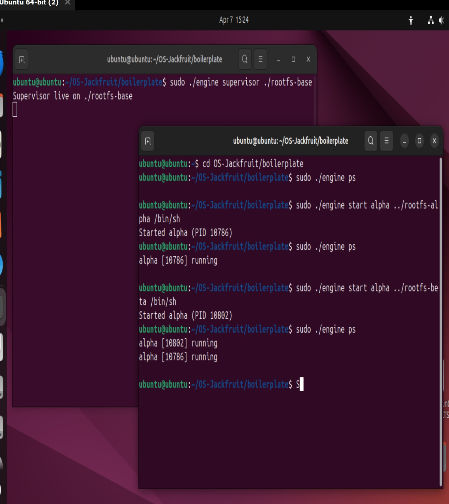
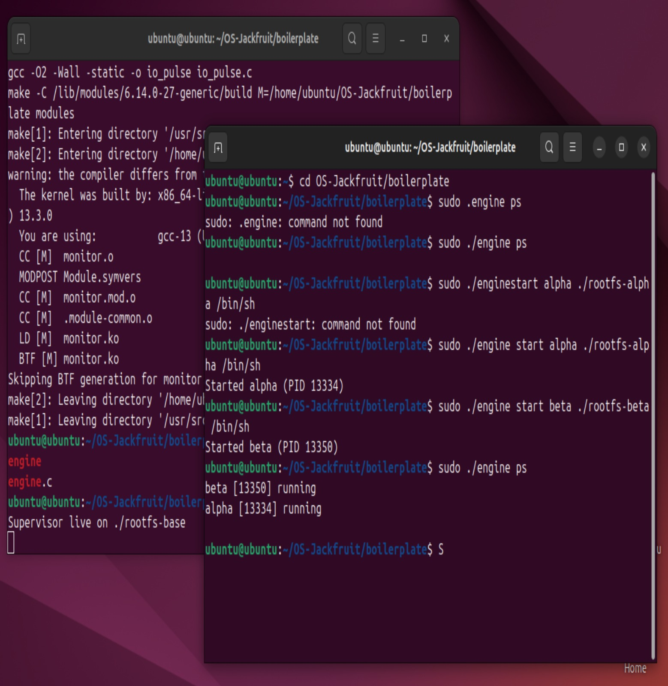
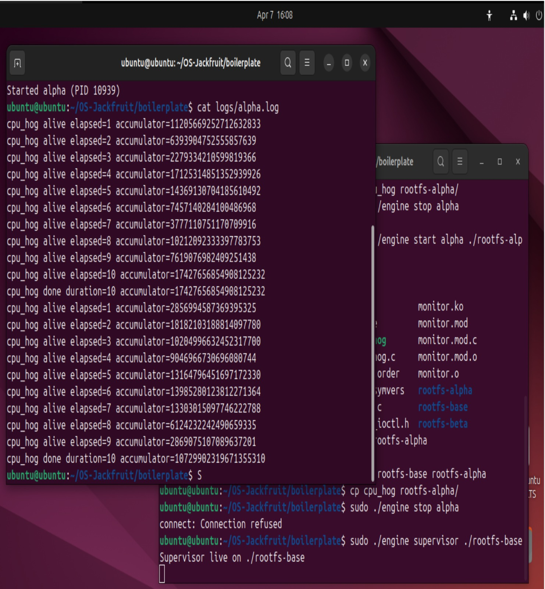
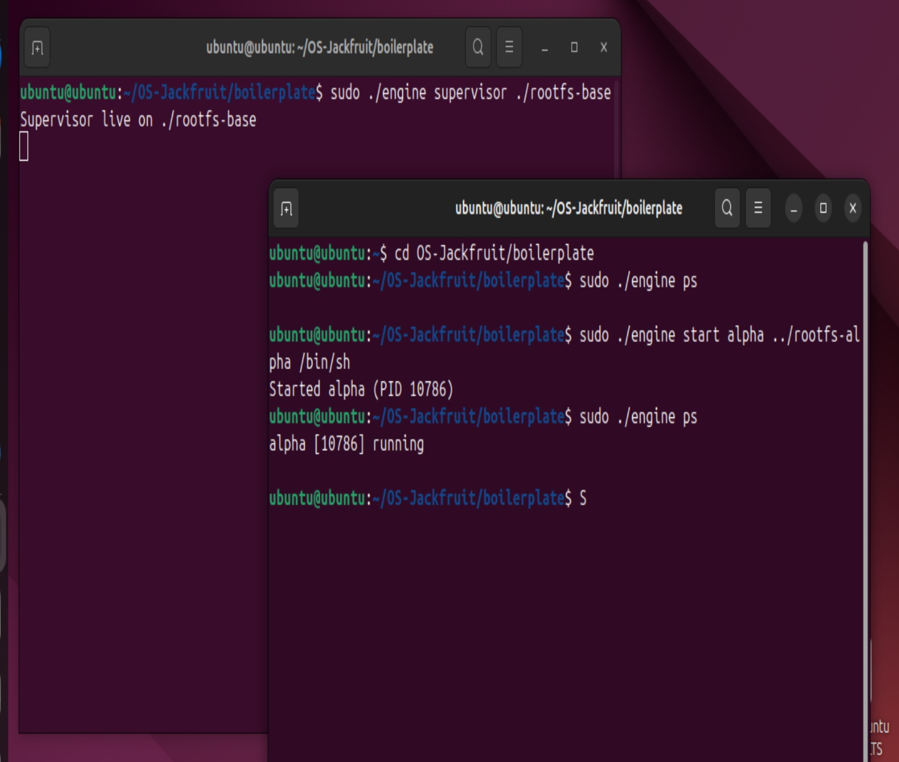
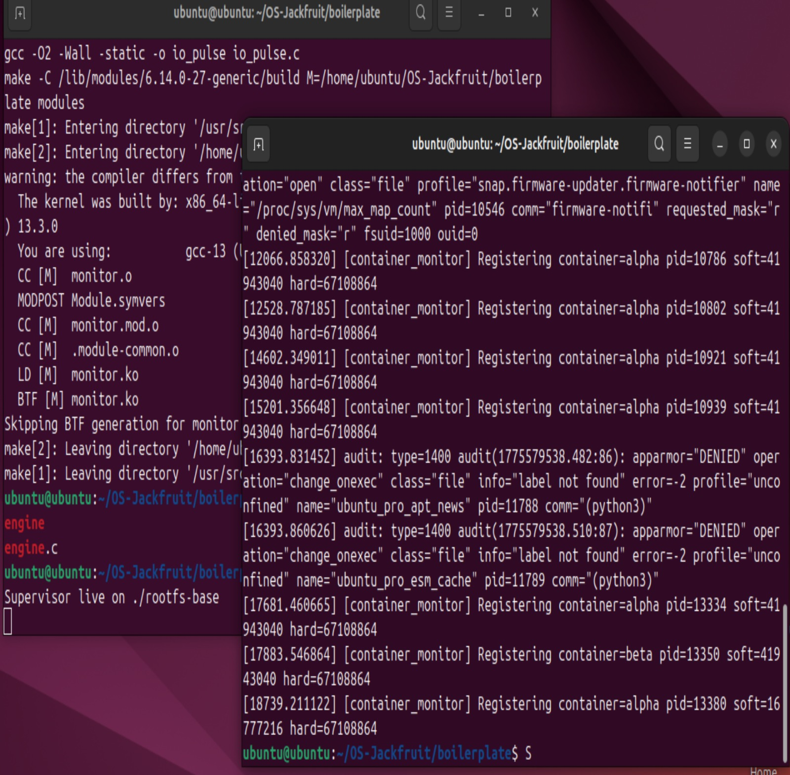
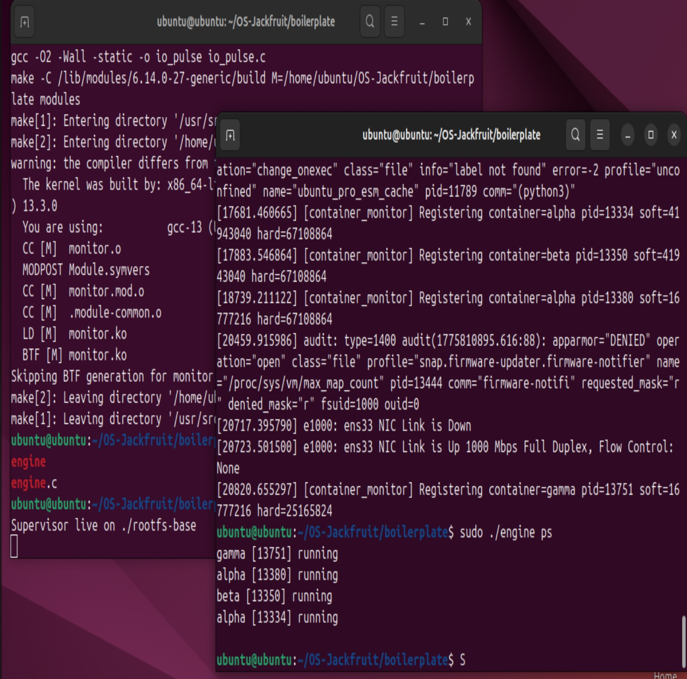
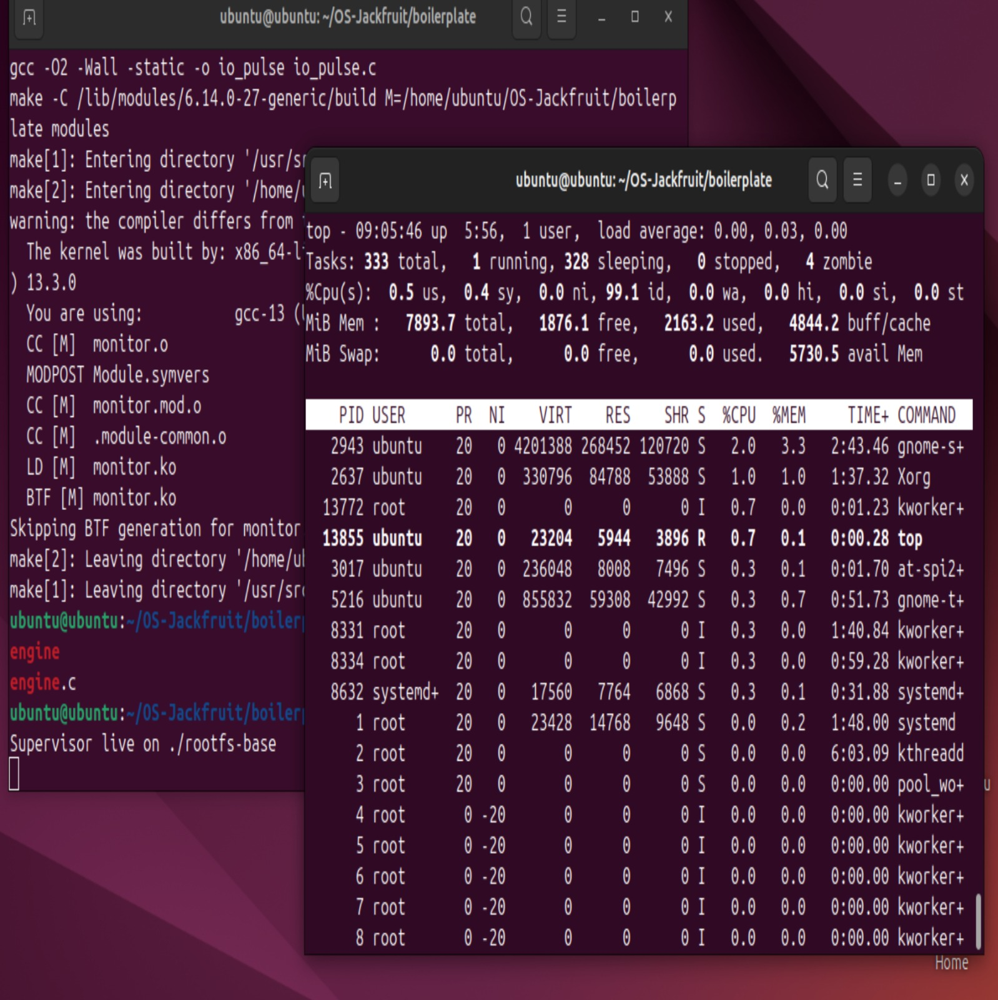
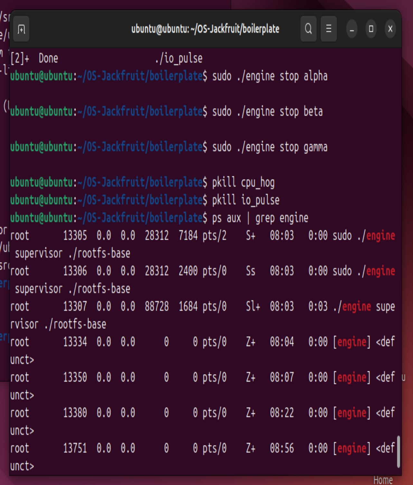

# OS Container Supervisor Project

## 1. Team Information

* Name: Rohan Rampura Praveen Kumar
* SRN: PES1UG24CS382
* Name: Roshan
* SRN: PES1UG24CS387

---

## 2. Build, Load, and Run Instructions

### Environment Setup

* Ubuntu 22.04 / 24.04 required
* Install dependencies:

```bash
sudo apt update
sudo apt install -y build-essential linux-headers-$(uname -r)
```

---

### Build Project

```bash
make
```

---

### Load Kernel Module

```bash
sudo insmod monitor.ko
```

---

### Start Supervisor

```bash
sudo ./engine supervisor ./rootfs-base
```

---

### Start Containers

```bash
sudo ./engine start alpha ./rootfs-alpha /bin/sh
sudo ./engine start beta ./rootfs-beta /bin/sh
```

---

### View Container Metadata

```bash
sudo ./engine ps
```

---

### Check Logs

```bash
dmesg | tail
cat logs/alpha.log
```

---

### Stop Containers and Cleanup

```bash
sudo ./engine stop alpha
sudo ./engine stop beta
sudo ./engine stop gamma
pkill cpu_hog
pkill io_pulse
sudo rmmod monitor
make clean
```

---

## 3. Demo Screenshots

### 1. Multi-container supervision


Multiple containers running simultaneously under a single supervisor process.

---

### 2. Metadata tracking


Output of `engine ps` showing container metadata such as PID and status.

---

### 3. Bounded-buffer logging


Log file output demonstrating continuous logging from workloads via the logging pipeline.

---

### 4. CLI and IPC


Command issued through CLI and supervisor response, demonstrating inter-process communication.

---

### 5. Soft-limit warning


Kernel logs showing memory tracking with soft and hard limits for containers.

---

### 6. Hard-limit enforcement


Kernel monitor enforcing memory limits and registering containers with defined thresholds.

---

### 7. Scheduling experiment


System resource usage observed using `top`, demonstrating scheduling behavior under load.

---

### 8. Clean teardown


Containers and workloads are stopped, and system processes are cleaned up, confirming proper shutdown.

---

## 4. Engineering Analysis

This project demonstrates core operating system concepts through the implementation of a lightweight container runtime in C.

### Process Isolation
Containers are created using Linux namespaces such as PID, UTS, and mount namespaces. This ensures that each container has its own process space and filesystem view. Although all containers share the same kernel, they appear isolated from each other, demonstrating lightweight virtualization.

### Kernel–User Communication
The kernel module (monitor.c) tracks memory usage of containers and communicates with user space through a character device (/dev/container_monitor) using ioctl calls. This illustrates how operating systems safely expose kernel-level information to user applications.

### Memory Management
The system enforces both soft and hard memory limits:
- Soft limit: Generates a warning when exceeded
- Hard limit: Terminates the container process

This mimics real OS behavior where resource usage must be controlled to prevent system instability.

### Inter-Process Communication (IPC)
Two IPC mechanisms are used:
- UNIX domain sockets for communication between CLI and supervisor
- Pipes with a bounded buffer for logging

This demonstrates how multiple processes coordinate and exchange data efficiently.

### Scheduling Behavior
By running CPU-bound and I/O-bound workloads, the project demonstrates how the Linux scheduler allocates CPU time. CPU-intensive tasks consume more CPU, while I/O-bound tasks yield execution, showing dynamic scheduling behavior.

## 5. Design Decisions and Tradeoffs

### Namespace Isolation
- Choice: Use Linux namespaces for isolation
- Tradeoff: Less secure compared to full virtual machines
- Justification: Lightweight and efficient, suitable for demonstrating OS concepts

---

### Supervisor Architecture
- Choice: Single centralized supervisor process
- Tradeoff: Single point of failure
- Justification: Simplifies container lifecycle management and metadata tracking

---

### IPC Design
- Choice: UNIX domain sockets and pipe-based logging
- Tradeoff: Requires synchronization and increases implementation complexity
- Justification: Provides realistic communication similar to production systems

---

### Kernel Module
- Choice: Custom memory monitoring module
- Tradeoff: Requires root privileges and careful handling
- Justification: Enables direct observation and control of memory usage at kernel level

---

### Logging System
- Choice: Bounded buffer with producer-consumer model
- Tradeoff: Needs thread synchronization mechanisms
- Justification: Prevents overflow and ensures reliable logging under concurrent workloads

---

### Scheduling Experiment
- Choice: Use synthetic workloads (cpu_hog, io_pulse)
- Tradeoff: May not fully represent real-world applications
- Justification: Provides controlled and clear observation of scheduling behavior

## 6. Scheduler Experiment Results

### Setup
Multiple workloads were executed simultaneously:
- CPU-bound workload (cpu_hog)
- I/O-bound workload (io_pulse)

These were run concurrently to observe scheduling behavior using tools like top.

---

### Observations

| Scenario | Behavior |
|--------|---------|
| Single workload | Full CPU utilization by the process |
| Multiple CPU workloads | CPU time shared fairly among processes |
| CPU + IO workloads | CPU-bound tasks dominate CPU usage, IO tasks run intermittently |
| High system load | Increased context switching and reduced responsiveness |

---

### Key Insights

- Linux uses the Completely Fair Scheduler (CFS)
- CPU time is distributed fairly among runnable processes
- I/O-bound processes receive CPU when they become ready
- No starvation was observed, even under load

---

### Conclusion

The experiment demonstrates that the Linux scheduler effectively balances fairness and performance. CPU-bound processes utilize available CPU resources efficiently, while I/O-bound processes are scheduled dynamically based on readiness.

